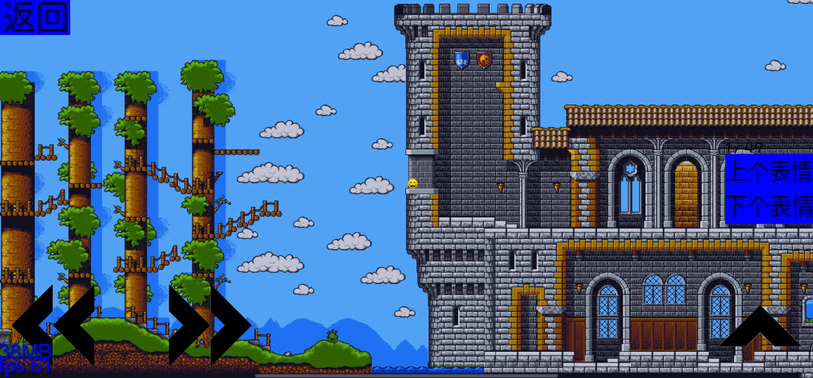
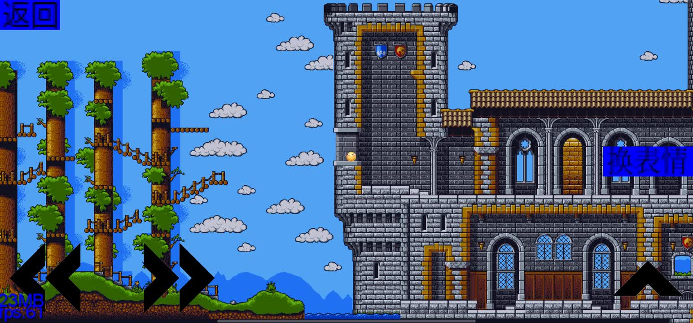

# 沙雕之主

## 阅读代码

>可以先看看项目构造
>从MyGdxGame.java开始看

## 软件编译

### 如果编译不了，可以尝试手机aide编译

>该游戏是我用手机写的，AndroidStudio可能编译不了
>你可以在手机aide上编译

### PC端

```
安装AndroidStduio
```

### 手机端

```
安装AIDE
```

## 游戏截图







