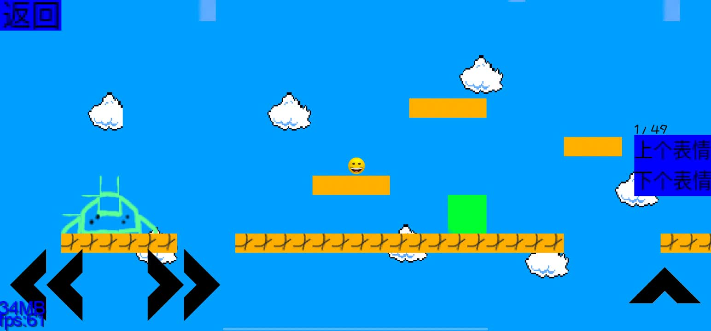

# 沙雕之主

## 阅读代码

>可以先看看项目构造

>从MyGdxGame.java开始看

[项目构造](https://gitee.com/hhshaohao/game-of-funny/blob/master/%E9%A1%B9%E7%9B%AE%E6%9E%84%E9%80%A0.txt)

## 软件编译

### 如果编译不了，可以尝试手机aide编译

>该游戏是我用手机写的，AndroidStudio可能编译不了
>你可以在手机aide上编译

### PC端

```
安装AndroidStduio
```

### 手机端

```
安装AIDE
```
### 使用gradle编译

```
终端运行：
gradle assembleDebug
或
gradlew assembleDebug
完成编译
```

## 游戏截图





